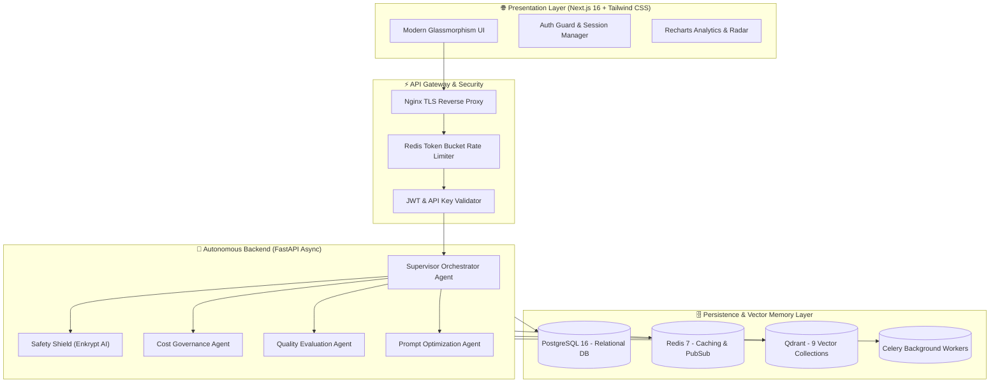

<div align="center">

# ⚡ AGENTOPS NEXUS
### *AI COO for Enterprise Agent Ecosystems — One Agent to Govern Every Other Agent*

[](https://agentops-nexus-p05mlx3fa-varadsapkal19.vercel.app/)
[](https://nextjs.org/)
[](https://fastapi.tiangolo.com/)
[](https://www.postgresql.org/)
[](https://qdrant.tech/)
[](https://www.docker.com/)
[](LICENSE)

<br/>

**[🌐 Experience Live Demo](https://agentops-nexus-p05mlx3fa-varadsapkal19.vercel.app/)** • **[📖 System Architecture](#-system-architecture)** • **[✨ Core Features](#-key-features)** • **[🚀 Quick Start](#-quick-start)** • **[🔐 Admin Credentials](#-default-admin-credentials)**

---

</div>

## 🌟 Executive Overview

**AgentOps Nexus** is an enterprise-grade AI governance, observability, and orchestration platform designed to supervise, evaluate, safeguard, and cost-optimize multi-agent LLM systems in production. 

Acting as an autonomous **AI Chief Operating Officer (COO)**, Nexus provides end-to-end tracing, hallucination detection via **Enkrypt AI**, vector memory indexing with **Qdrant**, token spend forecasting, and multi-model routing across OpenAI GPT-4o, Anthropic Claude 3.5, and Google Gemini.

```
┌──────────────────────────────────────────────────────────────────────────────────┐
│                               AGENTOPS NEXUS CORE                                │
│                                                                                  │
│   [ Multi-Agent Tracing ] ──> [ Enkrypt AI Guardrails ] ──> [ Qdrant Memory ]    │
│             │                               │                       │            │
│             ▼                               ▼                       ▼            │
│   [ Cost Governance ($) ] ──> [ Quality Radar (94.2%) ] ──> [ AI COO Insights ] │
└──────────────────────────────────────────────────────────────────────────────────┘
```

---

## 🚀 Live Production Demo

Experience the live, interactive production platform deployed on Vercel:

👉 **[https://agentops-nexus-p05mlx3fa-varadsapkal19.vercel.app/](https://agentops-nexus-p05mlx3fa-varadsapkal19.vercel.app/)**

### 🔐 Default Admin Credentials

| Parameter | Credentials |
| :--- | :--- |
| 📧 **Admin Email** | `admin@agentopsnexus.com` |
| 🔑 **Admin Password** | `Admin@123` |
| 🛡️ **Role** | Global Superadmin (Full Access) |

---

## 🏗️ System Architecture



---

## ✨ Key Features & Capabilities

### 🎛️ 1. Nexus Control Center (`/dashboard`)
* **Real-time Live Metrics:** Active agents running, token consumption rates, accumulated USD spend, and safety blocks.
* **Dual-Axis Recharts Visualizations:** Daily token usage vs cost curves with 7-day trend analysis.
* **AI Model Distribution:** Dynamic breakdown of requests across GPT-4o, Claude 3.5, GPT-4o Mini, and Gemini 1.5.
* **Live Streaming Execution Feed:** Real-time log table showing run IDs, latencies, model targets, and output quality.

### 🛡️ 2. AI Safety Shield & Enkrypt Guardrails (`/dashboard/safety`)
* **Hallucination Interception:** Real-time factual accuracy checks preventing unverified statements.
* **PII Redaction Engine:** Automated anonymization of SSNs, emails, and credit card numbers before egress.
* **Prompt Injection & Jailbreak Defense:** Strict boundary enforcement against adversarial prompt manipulation.
* **Violation Stream Table:** Immediate triage log showing blocked requests and sensitivity levels.

### 💰 3. AI Cost Governance & Forecasting (`/dashboard/costs`)
* **Stacked Spend Breakdown:** Daily cost distribution categorized by foundation model providers.
* **Budget Utilization Ring:** SVG progress tracker with dynamic end-of-month projection alerts.
* **Cost-per-Agent Ratio:** Visual progress indicators highlighting top-spending agents with model switch recommendations.

### 🎯 4. Quality & Evaluation Engine (`/dashboard/quality`)
* **Multi-Dimensional Radar Chart:** Scored across 6 core criteria (Relevance, Groundedness, Coherence, Completeness, Accuracy, Safety).
* **Hallucination Rate Tracker:** Continuous benchmarking of responses against ground-truth RAG knowledge.

### 🧠 5. Vector Memory & Qdrant Engine (`/dashboard/memory`)
* **9 Pre-configured Collections:** `agent_memories`, `hallucinations`, `prompt_templates`, `knowledge_documents`, `safety_incidents`, etc.
* **Interactive Semantic Search Playground:** Query Qdrant vector points with real-time cosine similarity scores and payload inspection.

### 🔄 6. Visual Multi-Agent Workflows (`/dashboard/workflows`)
* **DAG Pipeline Canvas:** Visual step-by-step preview showing Trigger ➔ Guardrail ➔ LLM Router ➔ Action nodes.
* **Automated Failure Fallback:** Self-healing routing when upstream provider APIs experience rate limits or timeouts.

### 📝 7. Prompt Engineering & Versioning (`/dashboard/prompts`)
* **Diff History & Version Control:** Track prompt revisions, rollback changes, and monitor quality scores per version.
* **Variable Tag Injection:** Visual tags for declared prompt template variables (`{{context_summary}}`, `{{agent_role}}`).

---

## 🛠️ Tech Stack

| Domain | Technologies |
| :--- | :--- |
| **Frontend** | Next.js 16 (Turbopack), React 19, TypeScript, Tailwind CSS v4, Framer Motion, Recharts, Lucide Icons, Zustand |
| **Backend** | Python 3.12, FastAPI (Async), SQLAlchemy 2.0 ORM, Alembic, Pydantic v2, Structlog, OpenTelemetry |
| **Database & Cache** | PostgreSQL 16, Redis 7 (Pub/Sub & Caching), Qdrant Vector DB (HNSW Indexing) |
| **AI & LLM Integration** | OpenAI SDK, Anthropic SDK, LiteLLM Proxy, Enkrypt AI, LangChain, LangGraph |
| **DevOps & Infra** | Docker, Docker Compose, Nginx, Prometheus, Grafana, GitHub Actions CI/CD |

---

## 🚀 Quick Start Guide

### Option 1: Run Locally with Turbopack

```bash
# 1. Clone repository
git clone https://github.com/Varadsapkal19/agentops-nexus.git
cd agentops-nexus

# 2. Install dependencies & launch Web Dashboard
npm install
npm run dev
```
> Open **[http://localhost:3000](http://localhost:3000)** in your browser.

---

### Option 2: Run Full Stack with Docker Compose

Ensure **Docker Desktop** is running, then execute:

```bash
# Build and launch all 8 microservices
docker compose -f docker-compose.dev.yml up --build
```

#### 🌐 Service Port Matrix:

* **Frontend Dashboard:** [http://localhost:3000](http://localhost:3000)
* **FastAPI Swagger API Docs:** [http://localhost:8000/api/docs](http://localhost:8000/api/docs)
* **Grafana Monitoring:** [http://localhost:3001](http://localhost:3001) *(admin / admin)*
* **Qdrant Vector DB Console:** [http://localhost:6333/dashboard](http://localhost:6333/dashboard)
* **Prometheus Metrics:** [http://localhost:9090](http://localhost:9090)

---

## 📂 Repository Structure

```tree
agentops-nexus/
├── apps/
│   ├── api/                     # FastAPI Python Backend
│   │   ├── app/
│   │   │   ├── agents/          # 7 Autonomous AI Governance Agents
│   │   │   ├── api/v1/          # 22 REST Endpoint Modules
│   │   │   ├── core/            # Database, Redis, Celery & Security
│   │   │   ├── models/          # 16 PostgreSQL SQLAlchemy ORM Models
│   │   │   ├── middleware/      # Rate Limiting & Structured Logging
│   │   │   └── utils/           # Qdrant Vector Setup & Email
│   │   ├── Dockerfile           # Multi-stage Python Container
│   │   └── requirements.txt     # Backend Dependencies
│   └── web/                     # Next.js 16 Frontend Dashboard
│       ├── app/                 # App Router (14 Dashboard Subpages + Auth)
│       ├── components/ui/       # Premium Reusable Nexus Glassmorphism UI
│       ├── hooks/               # Animated Counters & Hooks
│       └── lib/                 # Utility Formatters
├── infra/                       # Nginx, Prometheus, Grafana, K8s & Terraform
├── docker-compose.dev.yml       # Development Multi-Container Spec
├── docker-compose.prod.yml      # Production Multi-Container Spec
└── vercel.json                  # Vercel Deployment Configuration
```

---

## 👤 Author & Acknowledgements

**Varad Sapkal**  
*AI/ML Engineer & Systems Architect*  
* 💼 **LinkedIn:** [linkedin.com/in/varadsapkal](https://linkedin.com)  
* 🐙 **GitHub:** [@Varadsapkal19](https://github.com/Varadsapkal19)  
* 🌐 **Live Demo:** [agentops-nexus-p05mlx3fa-varadsapkal19.vercel.app](https://agentops-nexus-p05mlx3fa-varadsapkal19.vercel.app/)

---

<div align="center">
  <sub>Built with ❤️ for Enterprise AI Reliability. Released under the MIT License.</sub>
</div>
