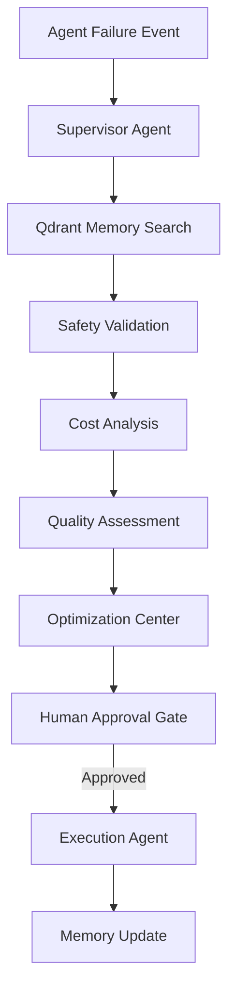

# System Architecture Guide

This document outlines the architectural topology, database design, and multi-agent coordination system of **AgentOps Nexus**.

---

## 1. Governance Workflow Topology

When an agent fails, times out, or triggers a safety policy, the event flows through this pipeline:
1.  **Event Capture**: Middleware captures the error trace and passes it to the **Supervisor Agent**.
2.  **Semantic Context**: The Supervisor queries the Qdrant `incident_memory` collection to see if a similar error happened before and how it was resolved.
3.  **Governance Auditing**:
    *   **Cost Agent** evaluates the budget usage.
    *   **Safety Agent** uses Enkrypt AI checks to check for toxicity/PII.
    *   **Quality Agent** scores the response accuracy.
4.  **Action Plan**: The Optimization Agent proposes a fix (e.g. prompt tuning or model routing change) which is logged in the Recommendations registry.
5.  **Execution**: Once approved, the Execution agent automatically deploys the updated prompt or configuration.

---

## 2. Multi-Agent Coordination Registry

We define 5 core agents based on a modular `BaseAgent` class:
*   **Supervisor Agent**: The coordinator ("AI COO") executing high-level workflows.
*   **Safety Agent**: Shield executor validating inputs and outputs using Enkrypt AI.
*   **Cost Agent**: Controls token consumption budgets and optimizes model choices.
*   **Quality Agent**: Benchmarks output scores against ground truths.
*   **Optimization Agent**: Suggests prompt modifications and tuning.

---

## 3. Database Schema Layout

*   `users`: Core authentication identity supporting MFA/TOTP.
*   `organizations`: SaaS account subscription plans and domains.
*   `workspaces`: Logical project segments.
*   `agents`: AI configuration profiles, metrics, and parameters.
*   `agent_runs`: History of execution steps, token usage, latency, and scores.
*   `incidents`: Registered safety breaches, high costs, or prompt injection blocks.
*   `recommendations`: Proposed action plans.
*   `safety_policies`: Configuration schemas defining toxicity thresholds.
